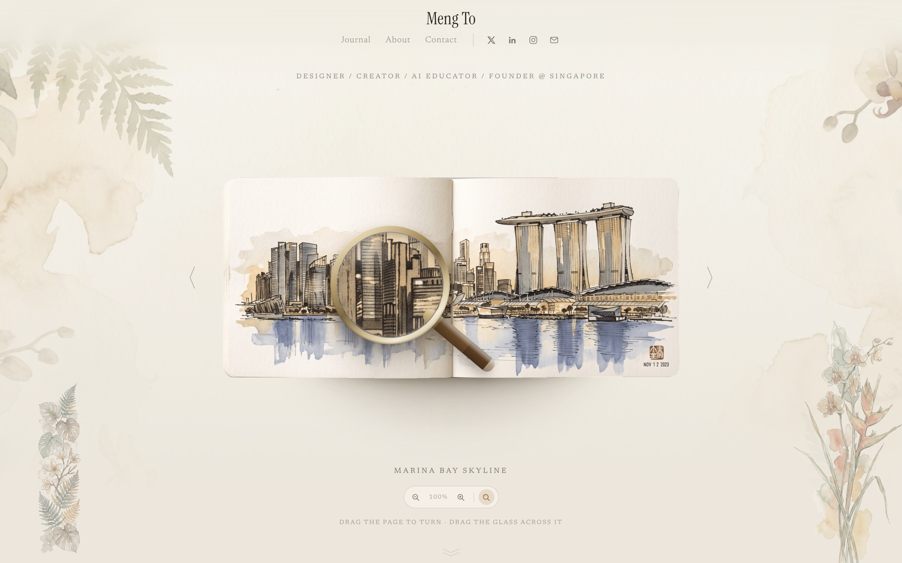

# 拾光册 · 私人收藏相册

一本可以翻页的私人收藏相册，单个静态 HTML 文件实现。拖动页面，纸叶会像真的纸一样弯着翻过去；再拖动黄铜放大镜，凑近看细部。



## 册子里面

- 九页藏品画稿，从滨海湾金沙到植物园，附一份目录，点开任意一件，册子会翻到那一页。
- 拖动册页即可翻页，甩一下就交给惯性：够快就翻过去，不够快就落回来。
- 一枚躺在纸面上的放大镜，可以拖到任何地方；翻页扫过时它会自己让路。
- 指针视差：册子会朝光标的方向微微倾侧，放大镜不会被带着一起走。
- 开场连翻：加载后自动快翻一遍，翻页带方向性运动模糊。
- 纸纹、水彩底色与植物装饰垫在整页底下。
- 无构建步骤、无依赖；字体与画作随仓库分发。仅中文字体（思源宋体）从 Google Fonts 取，取不到时回退系统宋体，版面照常成立。

## 实现要点

**翻页。** 翻动的那一叶不是绕铰链转的平面门板，而是一条嵌套纸条链，切线沿弧扫过，纸面因此沿着宽度弯出弧度，像真的纸那样翻过去。每条纸条带正反两面，靠 `backface-visibility` 完成正反切换，再加随纸叶角度变化的阴影渐变与高光。

**放大镜。** 镜片里装着册子的第二份副本，以镜下那个纸面点为中心缩放，再裁成圆形。这份副本在视差变换之外，所以册子倾侧不会把玻璃拽着走；玻璃挪出纸面时副本渐隐，剩下的就是普通玻璃，而不是浮在桌面上的半张纸。

**画稿。** 册页为 AI 生成的钢笔淡彩稿。纸纹、水彩底色与植物装饰给了这一页性格。

**字体。** 西文用 Instrument Serif 与 Newsreader，中文交给思源宋体，取不到时回退各系统自带的宋体。

所有内容都在 [`index.html`](index.html)：版式、样式、翻页几何、放大镜与交互状态。`sketchbook/` 文件夹存放画作与字体。

## 本地运行

用任意静态文件服务器起一个目录，然后打开本地地址：

```sh
python3 -m http.server 4173
```

直接双击打开 `index.html` 也可以，只是字体走 http 时加载得更稳。

## 更换藏品图片

三种方式，按顺手程度挑：

1. **可视化管理页（推荐）**：`python tools/admin.py` 启动本地服务，打开 <http://127.0.0.1:4173/admin.html>。把照片拖到卡片上、填题名与出处、可增删或调动顺序，点「写入仓库」——新册页与目录会直接写回 `sketchbook/` 和 `index.html`。照片会自动合成整幅册页：可选「铺满纸面」（会按比例裁剪）、「照片完整放入」（等比缩小、周围留白，适合竖图）、「右页照片 · 左页题字」（竖排题字加印章）；输出分辨率可选标准 1760×1240、高清 3520×2480（默认）或超清 5280×3720。
2. **同名覆盖**：用新图直接覆盖 `sketchbook/` 里的同名 PNG，零代码。
3. **改 `PAGES` 数组**：`index.html` 里集中了全部藏品清单（`file` / `title` / `place`），增删一行即可，目录与页数自动跟随。

图片规格：1760×1240、外围透明的整幅跨页 PNG（左右两页画在一张图里）。比例不同需同步调整 `.sb-book` 的 `aspect-ratio`。

## 可访问性与输入

触屏设备上没有可以拖动的光标，放大镜会隐藏，册子退化为点按翻页。`prefers-reduced-motion` 下跳过开场连翻，翻页也不再带动画。

## 部署

GitHub Pages 通过 [.github/workflows/pages.yml](.github/workflows/pages.yml) 从 `main` 分支构建发布；自定义域名见 `CNAME`。

## 致谢

- 概念与原始开源项目：[Matthew Yu 的 personalportfolio](https://github.com/matthewyuart/personalportfolio)
- 册页画稿：AI 生成的钢笔淡彩稿
